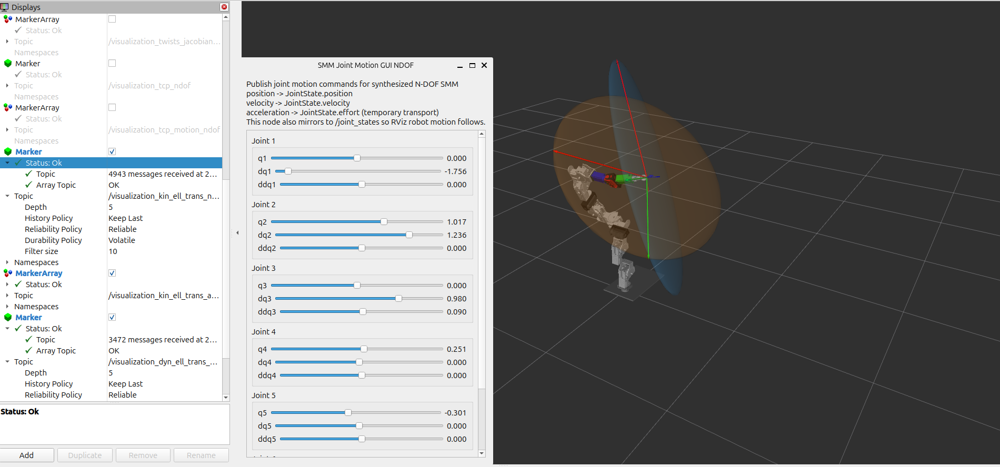
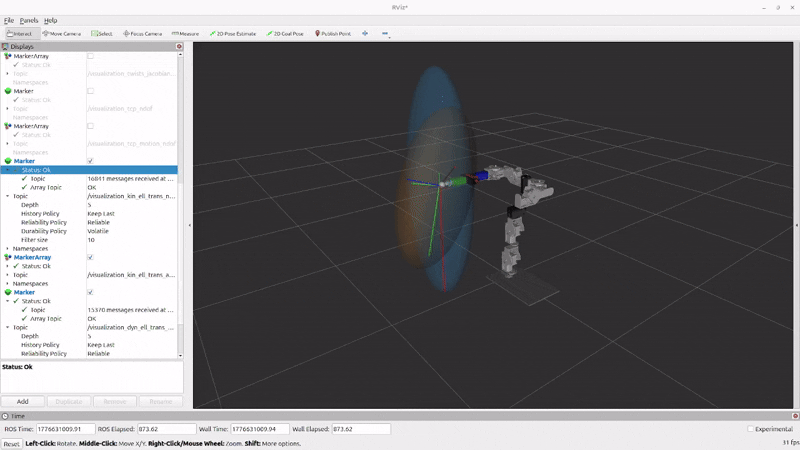

## Overview

`smm_synthesis` is the ROS 2 package that drives the main synthesis workflow for Ndof structures of the class of Serial Metamorphic Manipulators (SMMs). Its main launch file reads DoF-specific YAML configuration files from `./config/yaml/[x]dof/`, processes the selected robot structure and anatomy, and generates the extracted synthesis data into a workspace-level `smm_data` folder. The package also includes several additional example launch files used during development.

## Package Structure

```text
smm_synthesis/
├── config/
│   └── yaml/
│       └── [x]dof/              # Input YAML files for each robot DoF case
├── docs_cad/                    # Files with assembly info
├── meshes/                      # all 3D CAD files used
├── launch/                      # Master and example launch files
├── src/                         # Data extraction ROS nodes
├── urdf/                        # xacro files for each dof case
├── CMakeLists.txt
├── package.xml
└── README.md
```

## Xacro files

Xacro files is where synthesis magic happens! All structuring principles for SMMs have been parameterized and the resulting structure-case have been defined in xml format. 

- Currently 3 and 6 dof structures are ONLY available!!!

- The structure parameters are user-defined and can be inserted in the yaml files located in the config/yaml/[x]dof folder. In order to understand what each parameter does it is ESSENTIAL to read the papers listed below:

- to be updated!!!

## Master structure synthesis file

### `master_synthesis_ndof.launch.py`

This is the main synthesis launch file of the package.

- accepts a target SMM xacro model and automatically infers the robot DoF from the filename
- copies the corresponding DoF-specific `assembly_[x]dof.yaml` template into the live synthesis folder as `assembly.yaml`
- generates the robot description from xacro
- launches the visualization tools (`robot_state_publisher`, `joint_state_publisher_gui`, `rviz2`)
- runs the extraction nodes needed to compute the synthesis data
- writes all generated YAML outputs into the selected `data_dir`

## Cpp nodes in src

The `src/` folder contains the extraction and support nodes used by the synthesis workflow. The main N-DoF pipeline uses the following nodes:

- `active_frames_extractor_ndof`  
  Extracts active joint frames and writes them to `gsai0.yaml`.

- `com_extractor_kdl_ndof`  
  Extracts active link center-of-mass frames and writes them to `gsli0.yaml`.

- `inertia_extractor_kdl_ndof`  
  Extracts spatial inertia data and writes it to `Mscomi0.yaml`.

- `tcp_extractor_kdl_ndof`  
  Extracts the TCP frame and writes it to `gst0.yaml`.

- `twist_extractor_screws_ndof`  
  Reads active joint frames and generates active screw twists in `xi_ai_anat.yaml`.

- `passive_frame_extractor_kdl_ndof`  
  Extracts passive joint frames and writes them to `gspj0.yaml`.

- `passive_twist_extractor_screws_ndof`  
  Reads passive joint frames and generates passive screw twists in `xi_pj_anat.yaml`.

- `pseudo_angle_extractor_ndof`  
  Extracts valid pseudo-joint angles and writes them to `q_pj_anat.yaml`.

- `structure_digit_setter_ndof`  
  Support node used for structure-related parameter handling in the synthesis workflow.

## Generated yamls in smm_data folder

The synthesis pipeline generates the following YAML files in the selected `data_dir`:

- `assembly.yaml` — live assembly configuration copied from the selected DoF template
- `gsai0.yaml` — active joint frames
- `gsli0.yaml` — active link center-of-mass frames
- `Mscomi0.yaml` — spatial inertia matrices
- `gst0.yaml` — TCP frame
- `xi_ai_anat.yaml` — active screw twists
- `gspj0.yaml` — passive joint frames
- `xi_pj_anat.yaml` — passive screw twists
- `q_pj_anat.yaml` — pseudo-joint angles


## Example launch files (to be updated during devel phase)

## 1. TCP Motion & Kinematic Manipulability Visualization

`smm_synthesis_viz_tcp_and_kinematic_manipulability_ndof.launch.py`  
  Extends the synthesis pipeline with TCP motion(position, velocity, acceleration) and kinematic manipulability ellipsoid visualization.

### Scope

This launch configuration provides an extended visualization pipeline for the synthesized N-DoF SMM, focusing on task-space motion and kinematic performance.

It enables:
- interactive joint motion input (q, dq, ddq)
- TCP velocity and acceleration visualization
- computation of the kinematic manipulability ellipsoid
- real-time RViz visualization of motion and ellipsoid geometry

The pipeline builds directly on top of the synthesis workflow and uses the generated YAML data as input.

---

### Components Overview

#### Launch Files called
- `master_synthesis_ndof.launch.py`  
  Provides the full synthesis pipeline and robot visualization.

---

#### Nodes Used

- `smm_joint_motion_gui_ndof_node` *(smm_viz_tools)*  
  Custom GUI for joint motion input (q, dq, ddq).

- `smm_tcp_motion_ndof_viz_node` *(smm_viz_tools)*  
  Computes and visualizes TCP velocity and acceleration.

- `smm_kinematic_manipulability_ndof_node` *(smm_metrics)*  
  Computes kinematic manipulability ellipsoid parameters.

- `smm_kinematic_ellipsoid_ndof_viz_node` *(smm_viz_tools)*  
  Converts ellipsoid data into RViz markers.

---

#### Published Topics

- `/smm_joint_motion_cmd_ndof`  
  Joint motion command (q, dq, ddq)

- `/joint_states`  
  Mirrored joint states for visualization

- `/visualization_tcp_motion_ndof`  
  TCP velocity and acceleration markers (MarkerArray)

- `/smm/kinematic_manipulability_ellipsoid_ndof`  
  Kinematic manipulability ellipsoid message

- `/visualization_kin_ell_ndof`  
  Ellipsoid visualization (Marker)

- `/visualization_kin_ell_axes_ndof`  
  Ellipsoid principal axes (MarkerArray)

---

### Typical Usage

#### 3-DoF

```text
ros2 launch smm_synthesis smm_synthesis_viz_tcp_and_kinematic_manipulability_ndof.launch.py \
  data_dir:=/home/nikos/ros2_ws/src/smm_class_pkgs/smm_data/synthesis/yaml \
  xacro_path:=urdf/3dof/smm_structure_anatomy_assembly_3dof.xacro \
  dof:=3
  ```
```text
ros2 launch smm_synthesis smm_synthesis_viz_tcp_and_kinematic_manipulability_ndof.launch.py \
  data_dir:=/home/nikos/ros2_ws/src/smm_class_pkgs/smm_data/synthesis/yaml \
  xacro_path:=urdf/6dof/smm_structure_anatomy_assembly_6dof.xacro \
  dof:=6
  ```

## 2. Kinematic & Dynamic Manipulability Ellipsoid Visualization

`smm_synthesis_viz_ellipsoid_ndof.launch.py`  
Extends the synthesis pipeline with kinematic and dynamic manipulability ellipsoid computation and RViz visualization.

### Scope

This launch configuration provides an extended visualization pipeline for the synthesized N-DoF SMM, focusing on manipulability analysis in task space.

It enables:
- interactive joint motion input (`q`, `dq`, `ddq`)
- computation of kinematic manipulability ellipsoids
- computation of dynamic manipulability ellipsoids
- optional translational and rotational ellipsoid generation
- real-time RViz visualization of ellipsoid geometry and principal axes

The pipeline builds directly on top of the synthesis workflow and uses the generated YAML data as input.

---

### Components Overview

#### Launch Files called
- `master_synthesis_ndof.launch.py`  
  Provides the full synthesis pipeline and robot visualization.

---

#### Nodes Used

- `smm_joint_motion_gui_ndof_node` *(smm_viz_tools)*  
  Custom GUI for joint motion input (`q`, `dq`, `ddq`).

- `smm_kinematic_manipulability_ndof_node` *(smm_metrics)*  
  Computes kinematic manipulability ellipsoid parameters.

- `smm_dynamic_manipulability_ndof_node` *(smm_metrics)*  
  Computes dynamic manipulability ellipsoid parameters using the selected mass matrix formulation.

- `smm_ellipsoid_ndof_viz_node` *(smm_viz_tools)*  
  Generic ellipsoid visualization node used to convert ellipsoid messages into RViz markers.

---

### Published Topics

- `/smm_joint_motion_cmd_ndof`  
  Joint motion command (`q`, `dq`, `ddq`)

- `/joint_states`  
  Mirrored joint states for visualization

- `/smm/kinematic_manipulability_ellipsoid_trans_ndof`  
  Kinematic translational manipulability ellipsoid message

- `/smm/kinematic_manipulability_ellipsoid_rot_ndof`  
  Kinematic rotational manipulability ellipsoid message

- `/smm/dynamic_manipulability_ellipsoid_trans_ndof`  
  Dynamic translational manipulability ellipsoid message

- `/smm/dynamic_manipulability_ellipsoid_rot_ndof`  
  Dynamic rotational manipulability ellipsoid message

- `/visualization_kin_ell_trans_ndof`  
  Kinematic translational ellipsoid visualization (`Marker`)

- `/visualization_kin_ell_trans_axes_ndof`  
  Kinematic translational ellipsoid principal axes (`MarkerArray`)

- `/visualization_kin_ell_rot_ndof`  
  Kinematic rotational ellipsoid visualization (`Marker`)

- `/visualization_kin_ell_rot_axes_ndof`  
  Kinematic rotational ellipsoid principal axes (`MarkerArray`)

- `/visualization_dyn_ell_trans_ndof`  
  Dynamic translational ellipsoid visualization (`Marker`)

- `/visualization_dyn_ell_trans_axes_ndof`  
  Dynamic translational ellipsoid principal axes (`MarkerArray`)

- `/visualization_dyn_ell_rot_ndof`  
  Dynamic rotational ellipsoid visualization (`Marker`)

- `/visualization_dyn_ell_rot_axes_ndof`  
  Dynamic rotational ellipsoid principal axes (`MarkerArray`)

---

### Typical Usage

#### 3-DoF

```text
ros2 launch smm_synthesis smm_synthesis_viz_ellipsoid_ndof.launch.py \
  data_dir:=/home/nikos/ros2_ws/src/smm_class_pkgs/smm_data/synthesis/yaml \
  xacro_path:=urdf/6dof/smm_structure_anatomy_assembly_6dof.xacro \
  dof:=6 \
  joint_cmd_topic:=/smm_joint_motion_cmd_ndof \
  frame_id:=base_plate \
  run_kinematic_manipulability:=true \
  run_dynamic_manipulability:=true \
  publish_kinematic_translational:=true \
  publish_kinematic_rotational:=true \
  publish_dynamic_translational:=true \
  publish_dynamic_rotational:=true \
  dynamic_mass_matrix_representation:=body \
  dynamic_body_frame_selection:=joint
  ```

## 3. Visual Debug Pipeline for Kinematics & Dynamics

`smm_synthesis_visual_debug_only.launch.py`  
Extends the synthesis pipeline with a low-noise development/debug workflow for inspecting internal kinematics and dynamics computations of the synthesized N-DoF SMM.

### Scope

This launch configuration provides a controlled debug pipeline for the synthesized N-DoF SMM, focused on direct terminal inspection of internal screw-theory computations rather than RViz marker visualization.

It enables:
- interactive joint motion input (`q`, `dq`, `ddq`)
- one-shot or continuous debug execution
- forward kinematics inspection
- body Jacobian inspection
- CoM Jacobian inspection
- hybrid / operational Jacobian inspection
- TCP velocity and acceleration inspection
- joint-space mass matrix inspection
- operational-space mass matrix inspection
- joint-space Coriolis matrix inspection
- operational-space Coriolis vector inspection
- joint-space gravity vector inspection
- operational-space gravity vector inspection

The pipeline builds directly on top of the synthesis workflow and uses the generated YAML data as input.

---

### Components Overview

#### Launch Files called
- `master_synthesis_ndof.launch.py`  
  Provides the full synthesis pipeline and robot visualization.

---

#### Nodes Used

- `smm_joint_motion_gui_ndof_node` *(smm_viz_tools)*  
  Custom GUI for joint motion input (`q`, `dq`, `ddq`).

- `smm_visual_debug_only_node` *(smm_viz_tools)*  
  Development/debug node for controlled one-shot or continuous execution of selected `ScrewsKinematicsNdof` and `ScrewsDynamicsNdof` functions, printing matrices, vectors, and poses directly to terminal.

---

### Published Topics

- `/smm_joint_motion_cmd_ndof`  
  Joint motion command (`q`, `dq`, `ddq`)

- `/joint_states`  
  Mirrored joint states for visualization

---

### Typical Usage

#### 6-DoF one-shot debug of Jacobians and dynamics

```text
ros2 launch smm_synthesis smm_synthesis_visual_debug_only.launch.py   data_dir:=/home/nikos/ros2_ws/src/smm_class_pkgs/smm_data/synthesis/yaml   xacro_path:=urdf/6dof/smm_structure_anatomy_assembly_6dof.xacro   dof:=6   debug_once:=false   run_body_jacobians_1:=true   run_body_jacobians_2:=true   run_com_jacobians:=true   run_hybrid_jacobian:=true   run_mass_matrix:=true run_coriolis_matrix:=true run_gravity_vector:=true dynamics_representation:=body body_frame_selection:=com
  ```

### RViz Visualization




## License

This project is licensed under the BSD 3-Clause License. See the [LICENSE](LICENSE) file for details.